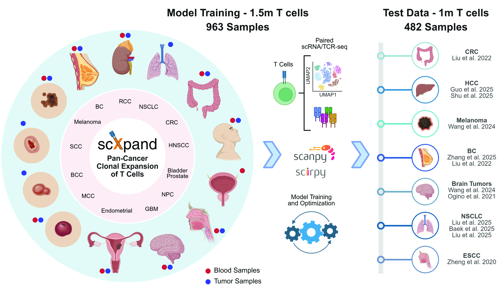

<div align="center">
  

  <h1 style="margin: 10px 0 5px 0;">scXpand: Pan-cancer Detection of T-cell Clonal Expansion</h1>

  <p style="margin: 0 0 25px 0; font-size: 0.95em; max-width: 800px; line-height: 1.4;">
    Detect T-cell clonal expansion from single-cell RNA sequencing data without paired TCR sequencing
  </p>

  <p style="margin: 0;">
    <a href="https://scxpand.readthedocs.io" style="margin: 0 8px;">Documentation</a> •
    <a href="#installation" style="margin: 0 8px;">Installation</a> •
    <a href="#quick-start" style="margin: 0 8px;">Quick Start</a> •
    <a href="docs/usage_examples.rst" style="margin: 0 8px;">Examples</a> •
    <a href="#citation" style="margin: 0 8px;">Citation</a>
  </p>
</div>

<div style="width: 100vw; margin-left: calc(-50vw + 50%); margin-right: calc(-50vw + 50%); margin-top: 20px; margin-bottom: 40px; padding: 0 40px;">
  
</div>

A framework for predicting T-cell clonal expansion from single-cell RNA sequencing data.

**Manuscript in preparation** - detailed methodology and benchmarks coming soon.

**[View full documentation](https://scxpand.readthedocs.io)** for comprehensive guides and API reference.


## Features

- **Multiple Model Architectures**:
  - **Autoencoder-based**: Encoder-decoder with reconstruction and classification heads
  - **MLP**: Multi-layer perceptron
  - **LightGBM**: Gradient boosted decision trees
  - **Linear Models**: Logistic regression and support vector machines
- **Scalable Processing**: Handles millions of cells with memory-efficient data streaming from disk during training
- **Automated Hyperparameter Optimization**: Built-in Optuna integration for model tuning

## Installation

**For CUDA-enabled systems:**
```bash
pip install scxpand[cuda]
```

**For other systems (CPU or non-CUDA GPU backends):**
```bash
pip install scxpand
```

See the [full installation guide](https://scxpand.readthedocs.io/en/latest/installation.html) for detailed setup instructions.

## Quick Start

```python
import scxpand
# Make sure that "your_data.h5ad" includes only T cells for the results to be meaningful
# Ensure that "your_data.var_names" are provided as Ensembl IDs (as the pre-trained models were trained using this gene representation)
# Please refer to our documentation for more information

# List available pre-trained models
scxpand.list_pretrained_models()

# Run inference with automatic model download
results = scxpand.run_inference(
    model_name="pan_cancer_autoencoder",  # default model
    data_path="your_data.h5ad"
)
```


## Documentation

See our **[Tutorial Notebook](notebooks/scxpand_tutorial.ipynb)** for a complete example with data preprocessing, T-cell filtering, gene ID conversion, and model application using a real breast cancer dataset.


**Getting Started:**
- **[Development Guide](docs/installation.rst)** - Setup for local development of scXpand
- **[Usage Examples](docs/usage_examples.rst)** - Detailed tutorials and CLI examples
- **[Data Format](docs/data_format.rst)** - Input data requirements and specifications

**Model Training & Optimization:**
- **[Model Architectures](docs/model_architectures.rst)** - Detailed architecture descriptions and configurations
- **[Hyperparameter Optimization](docs/hyperparameter_optimization.rst)** - Automated model tuning with Optuna
- **[Data Pipeline](docs/data_pipeline.rst)** - Preprocessing and normalization details

**Analysis & Evaluation:**
- **[Evaluation Metrics](docs/evaluation_metrics.rst)** - Performance assessment and stratified analysis
- **[Output Format](docs/output_format.rst)** - Understanding model outputs and results

**[📖 Full Documentation](https://scxpand.readthedocs.io)** - Complete guides, API reference, and interactive tutorials

## License

This project is licensed under the MIT License – see the [LICENSE](LICENSE) file for details.

## Citation

If you use scXpand in your research, please cite:

```bibtex
@article{scxpand2025,
  title={scXpand: Pan-cancer detection of T-cell clonal expansion from single-cell RNA sequencing without paired single-cell TCR sequencing},
  author={[Your Name]},
  journal={[Journal Name]},
  year={2025},
  doi={[DOI]}
}
```

This project was created in favor of the scientific community worldwide, with a special dedication to the cancer research community.
We hope you’ll find this repository helpful, and we warmly welcome any requests or suggestions - please don’t hesitate to reach out!

<p align="center">
  <a href="https://mapmyvisitors.com/web/1bz9s">
     
   </a>
</p>
<p align="center">
  <a href="#">
     
   </a>
</p>
