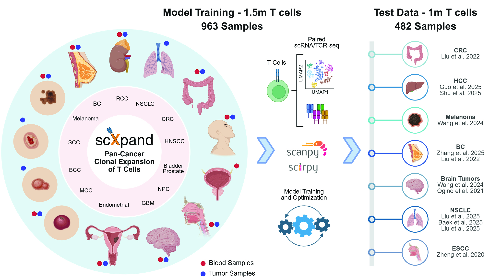

scXpand: Pan-cancer Detection of T-cell Clonal Expansion
=========================================================

scXpand is a framework for predicting T-cell clonal expansion from single-cell RNA sequencing data without paired TCR sequencing. It provides multiple methods for training and inference.

**GitHub Repository:** `https://github.com/yizhak-lab-ccg/scXpand <https://github.com/yizhak-lab-ccg/scXpand>`_

**Paper:** `https://www.cell.com/cell-genomics/fulltext/S2666-979X(26)00190-4 <https://www.cell.com/cell-genomics/fulltext/S2666-979X(26)00190-4>`_

.. toctree::
   :hidden:
   :maxdepth: 1

   user_guide
   tutorials
   contributing
   model_sharing
   api/index

..
   The toctree below is for structuring the landing page, not the sidebar.

Features
--------

* **Multiple Model Architectures**: Autoencoder, MLP, LightGBM, Logistic Regression, and SVM
* **Scalable Processing**: Handles millions of cells with memory-efficient data streaming
* **Hyperparameter Optimization**: Built-in hyperparameter search for model tuning

Installation
------------

For complete installation instructions including prerequisites, package installation, and development setup, please see our :doc:`installation` guide.

Quick Start
-----------

.. code-block:: python

   import scxpand
   # Make sure that "your_data.h5ad" includes only T cells for the results to be meaningful
   # scXpand requires raw UMI counts. Normalized or log-transformed data is not supported
   # Ensure that "your_data.var_names" are provided as Ensembl IDs (as the pre-trained models were trained using this gene representation)
   # Please refer to our documentation for more information

   # List available pre-trained models
   scxpand.list_pretrained_models()

   # Run inference with automatic model download
   results = scxpand.run_inference(
       model_name="pan_cancer_autoencoder",  # default model
       data_path="your_data.h5ad"
   )

   # Access predictions
   predictions = results.predictions
   if results.has_metrics:
       print(f"AUROC: {results.get_auroc():.3f}")

   # Or use the command line
   # scxpand inference --data_path your_data.h5ad --model_name pan_cancer_autoencoder

See our :doc:`user_guide` for comprehensive usage instructions.

Tutorials
------------
We provide a variety of tutorials to help you get started with scXpand:

- :doc:`Predicting T Cell Expansion from scRNA-seq Data <notebooks/scxpand_tutorial>` - download example scRNA-seq dataset (with no paired TCR-seq) and apply scXpand models for T cell expansion prediction using a breast cancer dataset example.

- :doc:`Preparing Training Data from Paired scRNA/TCR-seq <notebooks/data_preparation_tutorial>` - Complete pipeline for preparing labeled data (expansion status and tissue type) from paired scRNA/TCR-seq data, including quality control, MAGIC imputation, automatic cutoff determination for cell type classification, and expansion labeling.

- :doc:`Model Inference and Evaluation Pipeline <notebooks/inference>` - Load trained models, run inference on labeled data, and evaluate performance using ROC curves and AUROC metrics across different tissue types and labels.

- :doc:`Autoencoder Embedding Visualization <notebooks/embeddings>` - Generate and visualize latent representations from autoencoder models, coloring plots by expansion status and tissue type for biological insights.

Support and Contact
-------------------
This project was created in favor of the scientific community worldwide, with a special dedication to the cancer research community.
We hope you’ll find this repository helpful, and we warmly welcome any requests or suggestions - please don’t hesitate to reach out!

Citation
--------
If you use scXpand in your research, please cite our paper:

.. code-block:: text

   Shorer, O., Amit, R., and Yizhak, K. (2026). scXpand: Pan-cancer detection of T cell clonal expansion from single-cell RNA sequencing without paired single-cell TCR sequencing. Cell Genomics 6, https://doi.org/10.1016/j.xgen.2026.101328.

.. raw:: html

   

   
<b>BibTeX</b>

.. code-block:: bibtex

   @article{shorer2026scxpand,
     title={scXpand: Pan-cancer detection of T cell clonal expansion from single-cell RNA sequencing without paired single-cell TCR sequencing},
     author={Shorer, Ofir and Amit, Ron and Yizhak, Keren},
     year={2026},
     journal={Cell Genomics},
     doi={https://doi.org/10.1016/j.xgen.2026.101328}
   }

.. raw:: html

   

